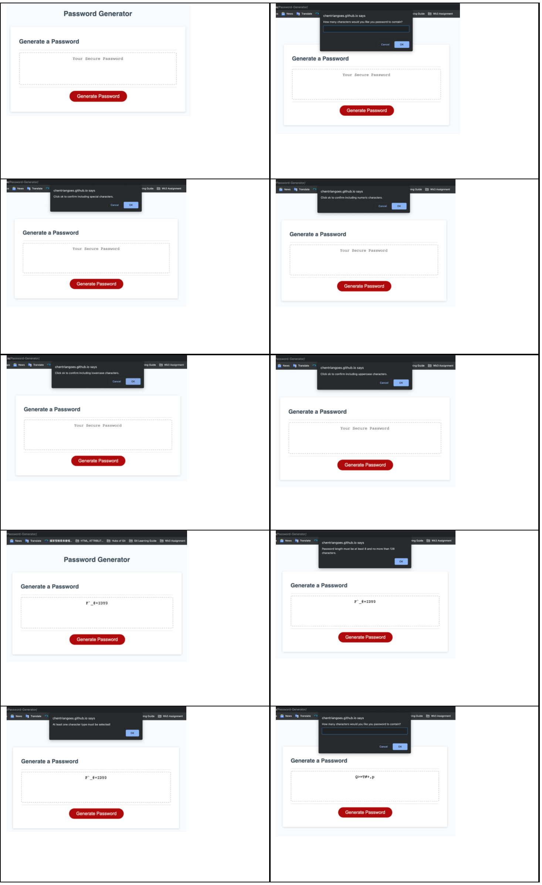

# 🖥 Password-Generator_YC 🖥

## 📋 Description 📋

This project is to create a password generator app enabling employees in need to create a rondomised selected password for accessing their digital accounts. Promts, confirmation and alert are established to show in window, guiding users to set their password composed of special, numberic, lowercase and uppercase characters in their desired length of password step by step. A randomised selected password in the given length can be hence generated in the text area of password.

### 👀 Key Features 👀

+ ⚓ Clear Instruction for Generating a Password
+ ⚓ Free from Forgetting Steps of Generating a Password
+ ⚓ Responsive Interface Adapting the User's Screen Size
+ ⚓ Clean and Polish Layout Easily for Operation
+ ⚓ Easy for Updation on Dinamical Modification of HTML and CSS
+ ⚓ Mutiple Types of Charaters as Choices for a Better Secure Passoword

## 📷 Screenshot 📷

## 🔗 Link 🔗

https://chentriangoes.github.io/Code4Dummies/